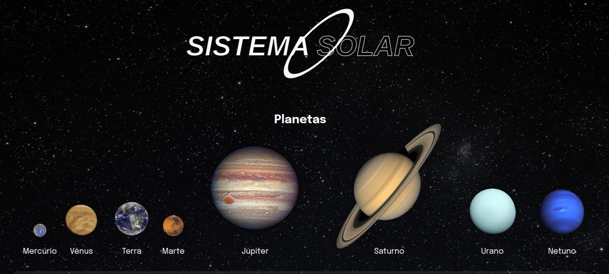

<h1>Bem vindo ao projeto o Solar System! </h1>

<h2> Sobre este projeto: </h2>

 Este projeto eu desenvolvi como parte do meu curso de desenvolvimento FullStack na Trybe, é constitui em uma página para listar todos os planetas do Sistema Solar. E, além dos planetas, tambem contem algumas das missões espaciais mais conhecidas.
 
 
O objetivo do projeto foi colocar em prática os conhecimentos obtidos no bloco de introdução ao React e assim implementar um pequeno conjunto de componentes e combiná-los para criar as listas de planetas e missões.

  
<strong>O que é a Trybe? 🤷🏽‍♀️</strong>
 
A Trybe é uma escola de desenvolvimento web genuinamente comprometida com o sucesso profissional de quem estuda com ela. O curso de desenvolvimento web fullstack contém mais de 1500 horas e é altamente orientado para a prática, onde aplicamos os conhecimentos obtidos em projetos como este.

 
<h2>Previa do projeto Solar-System </h2> 

<strong>Como utilizar:</strong>
 

<h3>Pré-requisitos<h3>

- Node.js 

<h3>Instalação<h3>

1. Clone este repositório em sua máquina
2. Instale as dependências do projeto com o comando: `npm install`
3. Inicie o servidor com o comando: `npm start`

<h2>Contato </h2>

 Para mais informações entre em contato comigo: 

